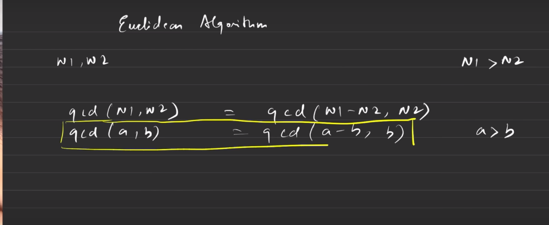

This is my brute force method
 let min=(a,b)=>{
            if(a>b){
                return b;
            }
            else{
                return a;
            }
}
class Solution{
    gcd(A, B){
      
        let res;
        //code here
      for(let i=1;i<=min(A,B);i++){
          if ((A%i===0) && (B%i===0)){
              res=i;
          }
      }
      return res;
    }
    
}

By Euclid Method we can solve it by
class Solution{
    gcd(A, B){
        //code here
        while(A!=B){
            if(A>B){
                A=A-B;
            }
            else{
                B=B-A;
            }
        }
        return A;
    }
}
